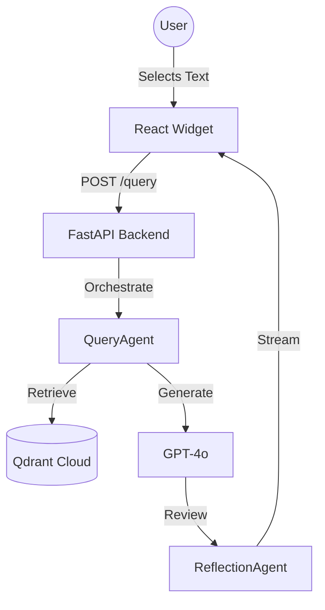

# AI-Driven Education: The Live Book 🎓🤖

[](https://github.com/panaversity/ai-native-book/actions)
[](https://render.com)
[](https://panaversity.org)
[](LICENSE)

> **A Spec-Driven, AI-Native Textbook with Embedded RAG Agents.**

This repository contains the source code for the **Panaversity Hackathon** entry: a "Live Book" that doesn't just teach you, but learns with you. It features a production-grade RAG system embedded directly into the Docusaurus interface, orchestrated by Spec-Kit Plus.

---

## 🏆 Built for the AI-Driven & Spec-Driven Faculty Hackathon

**Judges:** Zia Khan, Zeeshan Hanif, Daniyal Nagori, Bashir Ahmed, Imran Ali.

**Core Innovation:**
We moved beyond "Chat with PDF". We implemented a **Context-Aware Agentic Workflow**:
1. **Selection-Based RAG**: Highlight text -> Ask. The agent prioritizes the specific selection over general vector search.
2. **Reflection Loop**: A specialized `ReflectionAgent` evaluates every response for pedagogical quality before showing it to the student.
3. **Spec-Driven**: The entire agent architecture is generated from `specs/rag-agent-spec.md`.

---

## 🏗 Architecture



### The Stack
- **Frontend**: Docusaurus 3 (React + TypeScript) + Tailwind CSS.
- **Backend**: Python FastAPI.
- **AI Orchestration**: OpenAI Agents SDK.
- **Memory**: Qdrant Vector Database (Cloud Free Tier).
- **Deployment**: GitHub Pages (Frontend) + Render (Backend).

---

## 🚀 Quick Start

### 1. Clone & Install
```bash
git clone https://github.com/panaversity/ai-driven-education.git
cd ai-driven-education
npm install
```

### 2. Run Backend (Agent Swarm)
```bash
cd backend
python -m venv venv
source venv/bin/activate
pip install -r requirements.txt
# Requires .env with OPENAI_API_KEY and QDRANT_URL
uvicorn main:app --reload
```

### 3. Run Frontend (Live Book)
```bash
# In root directory
npm start
```
Visit `http://localhost:3000`. Highlight any text to see the magic.

---

## 📂 Project Structure

```
.
├── .github/workflows/   # CI/CD Pipelines
├── backend/             # FastAPI + LangChain Agents
│   ├── main.py          # Agentic Orchestrator
│   └── Dockerfile       # Backend Container
├── specs/               # Spec-Kit Plus Definitions
│   └── rag-agent-spec.md
├── src/                 # React Frontend Components
│   ├── components/      # ChatWidget.tsx (The Floating Brain)
│   └── theme/           # Docusaurus Layouts
├── constants.tsx        # The Book Content (Spec-Generated)
└── render.yaml          # Infrastructure as Code
```

---

## 🧠 Spec-Kit Plus Integration

This project strictly follows the **Panaversity Spec-Driven Development** methodology.
- **Agents** are defined in `specs/rag-agent-spec.md`.
- **Maturity Models** are defined in `types.ts` and rendered dynamically.
- **Skills** (like `education-embedding-skill`) are modular TypeScript functions.

## 🤝 Contributing

This project is designed to be merged into the [AI-Native Software Development](https://github.com/panaversity/ai-native-software-development) curriculum.

1. Fork the repo.
2. Create a feature branch (`git checkout -b feature/AmazingFeature`).
3. Commit your changes.
4. Open a Pull Request.

---
*Generated by the Panaversity Lead Engineer Agent.*
