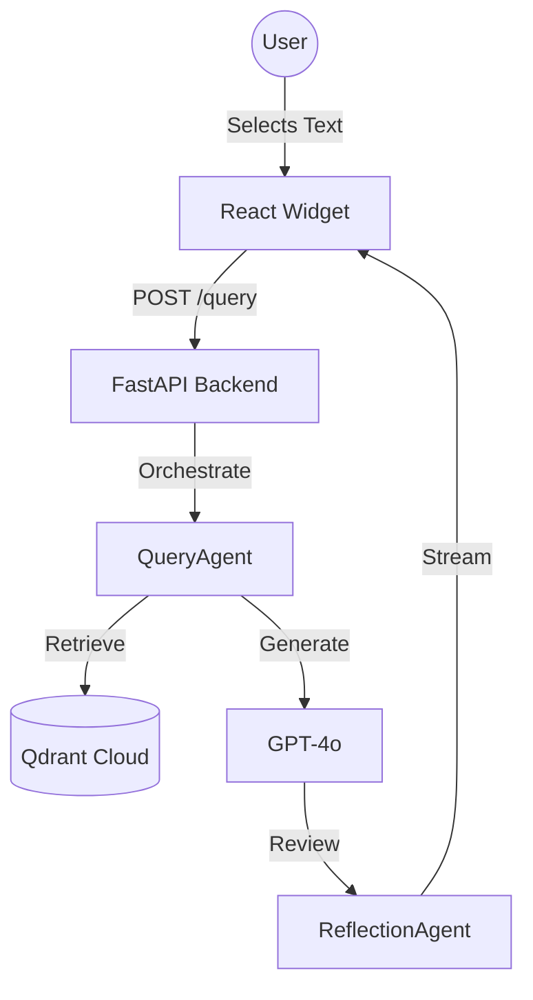

This page demonstrates the interactive RAG agent. Highlight any text in the book and click the floating "Ask" button to query the agent.

## How it works (Architecture Diagram)

**Note:** The embedded RAG agent queries the content of this book.