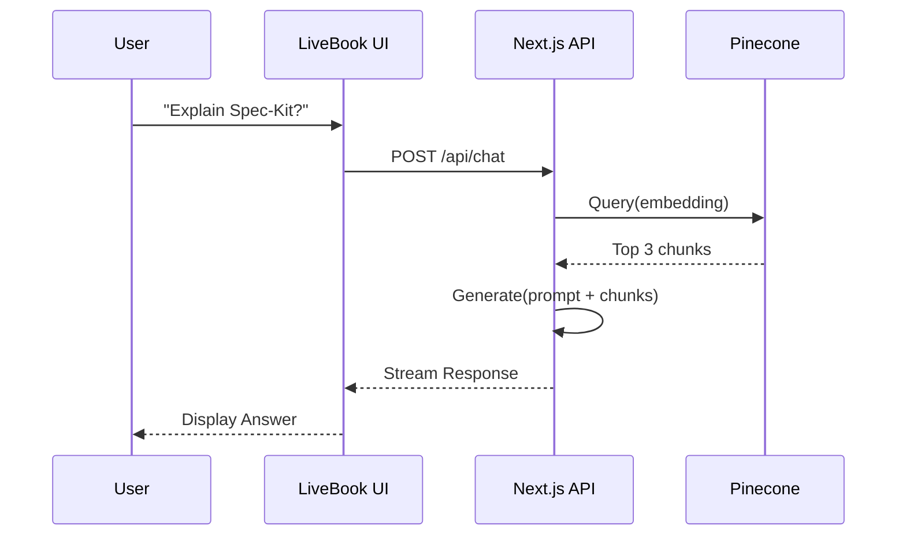

A "Live Book" listens. It answers questions about itself.

## The Chat Component
```tsx title="src/theme/Layout.tsx"
// Swizzled Layout to inject Chatbot
import React from 'react';
import Layout from '@theme-original/Layout';

export default function LayoutWrapper(props) {
  return (
    <>
      <Layout {...props} />
      <div className="fixed bottom-5 right-5 z-50">
        <iframe src="/ask" className="w-96 h-[500px] rounded-xl shadow-2xl" />
      </div>
    </>
  );
}
```
## Data Flow
