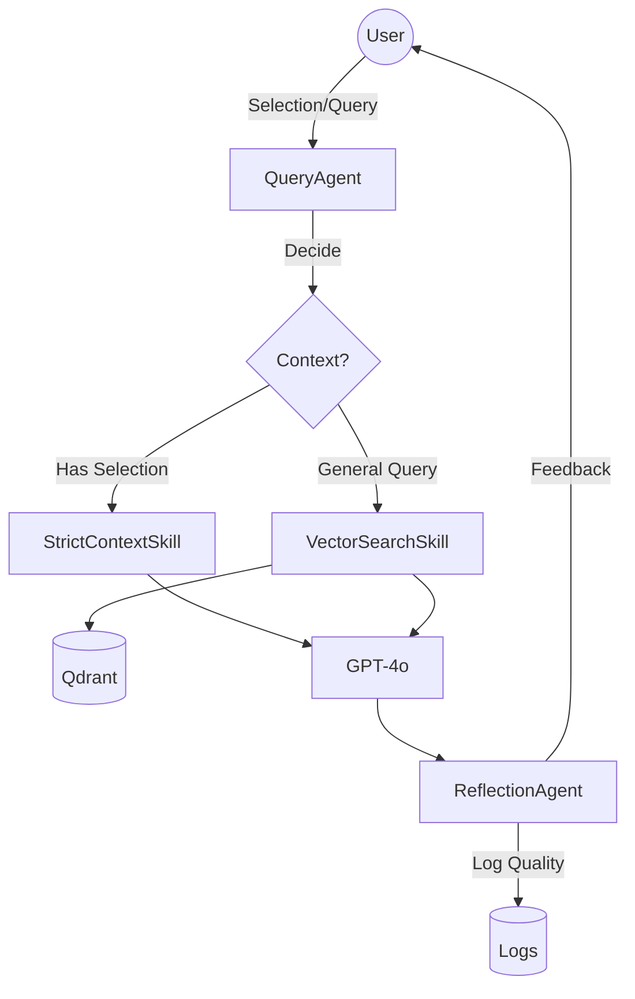

# 1. Architecture Overview

The system utilizes a Multi-Agent pattern orchestrated by a central QueryAgent.

# 2. Agent Specifications

## 2.1 IngestionAgent
**Role:** Prepares curriculum for RAG.
**Skill: `education-embedding-skill`**
- **Chunk Strategy:** RecursiveCharacterTextSplitter
- **Chunk Size:** 1000 tokens
- **Overlap:** 200 tokens
- **Metadata:** `{ chapter_id: string, maturity_level: int, source_hash: string }`

## 2.2 QueryAgent
**Role:** The primary interface for the student.
**Instructions:**
1. You are a Panaversity Tutor.
2. If `selected_context` is provided, IGNORE all outside knowledge and answer ONLY based on that selection.
3. If no selection, perform a vector search.
4. Always cite the chapter source.

## 2.3 ReflectionAgent
**Role:** Quality Assurance Loop.
**Trigger:** Post-response generation.
**Evaluation Criteria:**
1. Did the answer reference the provided context? (Grounding score)
2. Is the tone encouraging/Socratic? (Pedagogy score)
3. If Score < 0.7, flag for human review.

# 3. Evaluation Suite (Golden Questions)

| ID | Question | Expected Concept | Context Source |
|----|----------|------------------|----------------|
| Q1 | "What is Spec-Kit Plus?" | Executable specifications | Ch 3 |
| Q2 | "How does RAG prevent hallucinations?" | Grounding in vector store | Ch 5 |
| Q3 | "Define AI-Native." | Personalization, Agentic LMS | Ch 2 |
| Q4 | "What is the role of faculty?" | Learning Architects | Ch 1 |
| Q5 | "Explain the Co-Learning loop." | Student teaches AI | Ch 8 |
| Q6 | "How do I deploy this book?" | GitHub Pages / Render | Ch 4 |
| Q7 | "What is a reusable skill?" | TypeScript Tool | Ch 7 |
